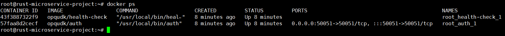

# Microservice project



```bash
AUTH_SERVICE_IP=[server ip] cargo run --bin client
```

## Objects

- Designing, building, and deploying microservices
- Using gRPC to communicate between microservices (session based authentication)
- Monitoring the health of microservices
- Setting up continuous integration & continuous deployment
- Using session based authentication
- Writing testable code

[Install protoc](https://grpc.io/docs/protoc-installation/)
